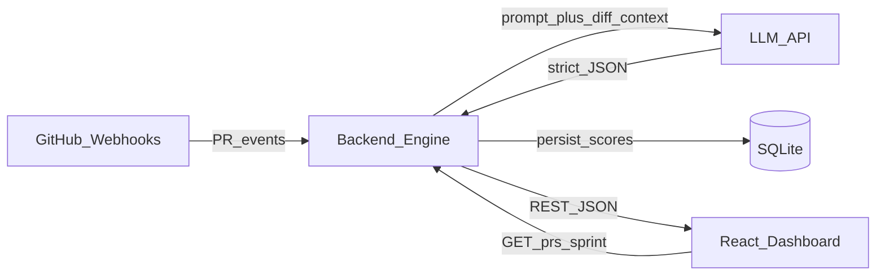

# System Architecture Map

> Boxes and arrows only — enough to spot failure points before Day 1.  
> Product defaults: [`_shared/product.yml`](_shared/product.yml) · Wire shapes: [`04-api-contracts/`](04-api-contracts/)

---

## Data flow



Optional path (demo nicety): `Engine → GitHub API` (PR comment with AI summary).

---

## Components

| Box | Role | Notes |
| --- | --- | --- |
| **Event Source** | GitHub Webhooks | `pull_request` (opened/synchronize/reopened). Verify `X-Hub-Signature-256`. |
| **Engine** | Backend API + workers | Normalize payload, call LLM, persist, serve REST. Stack **TBD** below. |
| **Brain** | LLM (OpenAI-compatible) | Must return JSON matching [`llm-output.schema.json`](04-api-contracts/schemas/llm-output.schema.json). |
| **Storage** | SQLite | PR metadata + AI scores. Postgres optional later / Docker. |
| **Glass** | TypeScript / React | Consumes `GET /api/prs/active` and `GET /api/sprint/health`. |

Contracts between Brain / Engine / Glass are **stack-agnostic**. Changing Go ↔ Node ↔ Python does not change schemas.

---

## Stack decision (placeholder)

**Decision: TBD — fill before Day 1 coding.**

| Criterion | Go | TypeScript (Node) | Python (FastAPI) |
| --- | --- | --- | --- |
| Webhook concurrency | Strong (goroutines, low overhead) | Good (async event loop) | Good enough for demo |
| LLM / JSON DX | More verbose; solid HTTP libs | Excellent (shared types with FE possible) | Excellent (Pydantic / JSON Schema) |
| Type sharing with React | Separate OpenAPI/types gen | Same language family; easy shared types | Schema-first; generate or hand-copy |
| Ops / single binary | Excellent | Needs Node runtime | Needs Python runtime / venv |
| Team familiarity / speed | TBD | TBD | TBD |
| Hackathon fit | Fast runtime; steeper JSON/LLM glue | Fastest full-stack TS team | Fastest AI-glue team; matches common LLM tutorials |

**How to decide (15 minutes):**

1. Fill the “Team familiarity / speed” row honestly.
2. Prefer the stack the majority of implementers can ship without fighting the toolchain.
3. Record the choice here and in `defaults.backend_stack` inside [`product.yml`](_shared/product.yml).

```text
Chosen backend: _______________
Date: _______________
Rationale (1–2 lines): _______________
```

---

## Request path (happy case)

1. GitHub sends webhook → Engine verifies signature.
2. Engine loads PR files / checks summary (GitHub API as needed).
3. Engine calls Brain with structured instructions → validates against LLM schema.
4. Engine upserts scored PR in SQLite.
5. Glass polls or refreshes `GET /api/prs/active`; sprint panel reads mocked `GET /api/sprint/health`.

---

## Failure points (watch early)

| Risk | Symptom | Mitigation |
| --- | --- | --- |
| Bad webhook secret / signature | Events ignored | Fail loud in logs; test with GitHub delivery UI |
| LLM timeout / rate limit | PR stuck “scoring” | Timeout + retry; fall back to example JSON on stage |
| Schema drift | UI breaks / parse errors | Validate LLM output; reject + re-prompt once |
| SQLite write races | Rare lock errors under burst | Serialize writes; fine for demo load |
| Tunnel / network drop | No live webhook on stage | Pre-warm + offline fixtures from `examples/` |

---

## Environment sketch

| Variable | Purpose |
| --- | --- |
| `GITHUB_WEBHOOK_SECRET` | HMAC verification |
| `GITHUB_TOKEN` | Read PR files / optional comments |
| `LLM_API_KEY` | Provider auth |
| `LLM_BASE_URL` | OpenAI-compatible endpoint (OpenAI, Gemini compat, local) |
| `LLM_MODEL` | Model id |
| `DATABASE_URL` | SQLite path or future Postgres DSN |
| `PORT` | Engine listen port |

Do not commit secrets. Use a local `.env` (gitignored).

---

## Related docs

- [Demo script](02-demo-use-case.md) — which path must work on stage  
- [API contracts](04-api-contracts/) — exact JSON between components  
