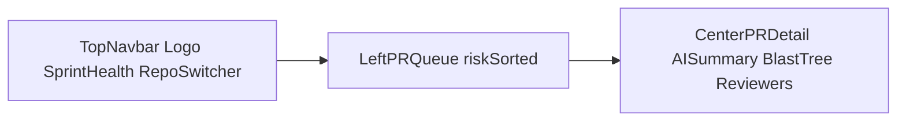

# Mergent Brand Kit

> **Product SoT:** [`_shared/product.yml`](_shared/product.yml)  
> **Tokens & logo:** [`brand/`](brand/)

Dark-mode-native developer-tool identity for the Glass dashboard and pitch materials. Inspired by production DevOps UIs (GitHub, Linear, Grafana, Vercel): cool surfaces, one restrained accent, precise status indicators — no AI-landing-page chrome.

---

## 1. Brand Identity

| Element | Value |
| --- | --- |
| **Name** | Mergent |
| **Tagline** | Engineering Intelligence Before the Merge. |
| **Secondary motto** | Clear sightlines for software delivery. |
| **Wordmark** | `Mergent` + optional mono `AI` badge (not `Mergent.ai` in UI chrome) |

### Brand voice

- **Direct & concise** — speak to Team Leads and SREs without marketing fluff.
- **Authoritative & calm** — reduce panic during high-risk deployment windows.
- **Proactive** — prevention and foresight, not reactive debugging.

---

## 2. Color System (Dark-Mode First)

### Core palette

| Token | Hex | Role |
| --- | --- | --- |
| BG Primary | `#0B0E14` | App canvas |
| BG Surface | `#131820` | Cards & panels |
| Elevated | `#1A212C` | Selected rows, menus |
| Border | `#243041` | Hairline dividers & inputs |
| Text Main | `#E8EEF6` | Primary text (soft white) |
| Text Muted | `#8B97A8` | Meta, timestamps |
| Brand Accent | `#4C8BF5` | Cool blue — links, focus, one CTA |
| Brand Hover | `#6BA0F7` | Hover / active emphasis |
| Brand Soft | `rgba(76, 139, 245, 0.12)` | Selected wash — no glow |

### Functional risk status

| Level | Hex | Usage |
| --- | --- | --- |
| Low / Safe | `#3D9B74` | Desaturated green — low risk, healthy sprint dots |
| Medium / Review | `#D19A26` | Desaturated amber — needs review |
| High / Blast Radius | `#E24B4A` | Desaturated red — high risk, critical paths |

Map API `risk_level` (`low` / `medium` / `high`) from fixtures in [`04-api-contracts/examples/`](04-api-contracts/examples/) to these three colors only. Do not invent rainbow status badges. Status dots are **flat** (no glow).

### Usage rules (keep it chill)

1. Brand blue on ~5% of the UI: focus ring, active nav, one primary button, selected queue item — not every surface.
2. Risk badges: soft tint (~15% alpha) + solid text/dot — flat, no glow.
3. **AI summary / reasoning:** same card surface + hairline border + muted mono label (`Reasoning`) — **no gradient borders**, no second “telemetry” accent.
4. Do not pair brand with a cyan/indigo companion color.

### Anti-patterns (avoid)

- Electric indigo (`#6366F1`) + cyan (`#06B6D4`) gradients
- Glow / bloom on dots or borders
- Rainbow badges
- Purple-on-dark “AI” framing

### Implementation

- CSS variables: [`brand/tokens.css`](brand/tokens.css)
- Tailwind extend snippet: [`brand/tailwind.mergent.extend.js`](brand/tailwind.mergent.extend.js)

---

## 3. Typography

| Role | Font | Notes |
| --- | --- | --- |
| Headings & navigation | **Geist** (fallback: system UI sans) | Clean, neutral, modern |
| Code, diffs, metrics, timestamps | **JetBrains Mono** (fallback: Fira Code, monospace) | Hashes, line counts, blast-radius paths |

### Type scale

| Style | Size | Weight | Color |
| --- | --- | --- | --- |
| Page title | 24px | Bold | `#E8EEF6` (text main) |
| Section header | 16px | SemiBold | `#D5DEE9` |
| Code / paths | 13px | Mono Regular | `#B8C2D0` |
| Meta / subtext | 12px | Medium | `#8B97A8` (muted) |

Body text minimum 14px (prefer 16px). Spacing on an **8px grid**.

---

## 4. Logo — “Focal Branch”

Geometric emblem: PR branch split + foresight prism/shield. Nodes use **brand blue**, **muted slate**, and **risk green** (two chromatic max — no cyan).

| Asset | Path |
| --- | --- |
| React component | [`brand/Logo.tsx`](brand/Logo.tsx) |
| Static SVG | [`brand/logo.svg`](brand/logo.svg) |

### Usage rules

- **Default navbar size:** 28px emblem.
- **Minimum emblem size:** 20px; do not shrink below that.
- **Clear space:** ≥ 8px around the lockup.
- **Prism stroke:** brand blue → muted slate (quiet, not rainbow).
- **Wordmark:** bold tracking-tight `Mergent` in text main.
- **AI badge:** mono 10px; muted gray fill/border (`muted` at ~15% / ~25%); text muted — not indigo.
- Do not recolor nodes to indigo/cyan.
- Favicon / slide deck: use `logo.svg` (emblem-only crop is fine).

Copy into the app later as `frontend/src/components/Logo.tsx`.

---

## 5. Hero Dashboard Layout (Glass)

When judges see the dashboard, it should read as high density and high utility — aligned with the [demo script](02-demo-use-case.md).

### Top navbar

1. **Left:** Logo lockup (`Mergent` + `AI`).
2. **Center:** Sprint health indicator — e.g. `Confidence: 84%` with a **flat** status dot (low / med / high).
3. **Right:** Active repo switcher (`org/repo-name`) + GitHub sync status.

### Left panel — PR priority queue

- Cards ordered by AI risk score (high at top).
- Risk badge uses semantic colors only.
- Selected row: `brand-soft` wash + hairline, not glow.
- Mini tags: `Blast Radius: N services`, `Diff: +X -Y`.
- Skeleton placeholders for loading (show after ~300ms); avoid spinners for predictable layout.

### Center — PR intelligence detail

1. **AI Summary** — card + hairline border + muted “Reasoning” label (no gradient frame).
2. **Blast Radius Tree** — files changed → affected services → downstream risks.
3. **Recommended Reviewers** — avatar chips; one primary CTA: **Assign reviewer** (brand blue).

### Component rules (ui-design-brain)

| Pattern | Rule |
| --- | --- |
| Header / Navigation | Visible nav; clear active state; logo left |
| Card / List | Media → title → meta → action; border **or** subtle elevation, not both |
| Badge | 1–2 words; pill for status; limited semantic palette |
| Avatar | Recommended reviewers |
| Tree view | Blast-radius path hierarchy |
| Button | Verb-first labels; one primary per section |
| Empty state | Headline + short help + CTA when queue is empty |

---

## 6. Pitch Deck / Presentation Theme

- **Background:** `#0B0E14` everywhere — never white slides.
- **Headings:** `#E8EEF6` with a single cool-blue underline or accent (not gradients).
- **Code / diffs:** framed in `#131820` cards with mono + syntax highlight.
- **Key numbers:** massive ~64pt mono in brand blue or risk green (e.g. impact metrics).

---

## 7. Day-1 frontend checklist

When scaffolding Glass:

1. Import [`brand/tokens.css`](brand/tokens.css) (or copy into `src/styles/`).
2. Merge [`brand/tailwind.mergent.extend.js`](brand/tailwind.mergent.extend.js) into `tailwind.config`.
3. Load Geist + JetBrains Mono (or CDN / `next/font` equivalent).
4. Mount [`brand/Logo.tsx`](brand/Logo.tsx) in the navbar.
5. Wire risk badges to `mergent.low` / `mergent.med` / `mergent.high` only.
6. Use `mergent.brand` sparingly; AI panels get hairline borders only.
