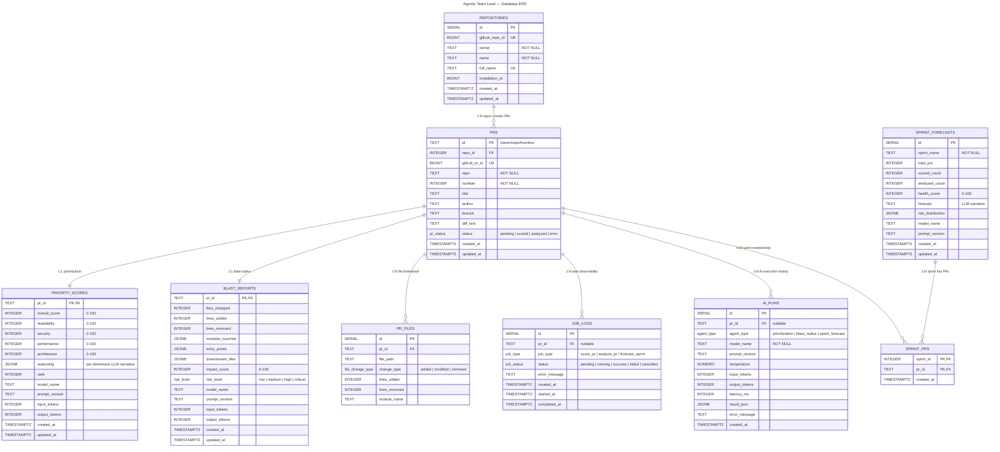

# Database ERD

> **Stack:** PostgreSQL · FastAPI BackgroundTasks · Modular Monolith  
---

## Entity Relationship Diagram



---

## Module Ownership

Each table is owned by exactly one module. No module writes to another module's tables.

| Module | Tables | Description |
|--------|--------|-------------|
| **Shared Kernel** | `repositories`, `prs` | GitHub App context and central PR registry. Read by all modules. |
| **Prioritization** | `priority_scores` | LLM scoring output per PR. |
| **Blast Radius** | `blast_reports`, `pr_files` | Impact analysis output and normalized file breakdown. |
| **Sprint Forecast** | `sprint_forecasts`, `sprint_prs` | Aggregate health snapshots and sprint-to-PR links. |
| **Observability** | `ai_runs`, `job_logs` | AI execution history and lightweight task tracking. |

---

## Table Details

### `repositories`

GitHub repository registry. Tracks installation context for the GitHub App.

| Column | Type | Constraints | Description |
|--------|------|-------------|-------------|
| `id` | `SERIAL` | **PK** | Internal ID |
| `github_repo_id` | `BIGINT` | **UQ** | Stable GitHub repository ID |
| `owner` | `TEXT` | `NOT NULL` | Repo owner |
| `name` | `TEXT` | `NOT NULL` | Repo name |
| `full_name` | `TEXT` | `NOT NULL`, **UQ** | `owner/name` |
| `installation_id` | `BIGINT` | | GitHub App installation ID |
| `created_at` | `TIMESTAMPTZ` | `DEFAULT now()` | First seen |
| `updated_at` | `TIMESTAMPTZ` | `DEFAULT now()` | Last updated |

**Indexes:** `github_repo_id`, `full_name`

---

### `prs` — Shared Kernel

Central registry. Every PR ingested via GitHub webhook lands here first.

| Column | Type | Constraints | Description |
|--------|------|-------------|-------------|
| `id` | `TEXT` | **PK** | Composite: `owner/repo#number` |
| `repo_id` | `INTEGER` | **FK -> repositories** | Parent repository |
| `github_pr_id` | `BIGINT` | **UQ** | Stable GitHub PR ID |
| `repo` | `TEXT` | `NOT NULL` | Repository full name |
| `number` | `INTEGER` | `NOT NULL` | PR number |
| `title` | `TEXT` | | PR title |
| `author` | `TEXT` | | GitHub username |
| `branch` | `TEXT` | | Source branch |
| `diff_text` | `TEXT` | | Cached raw diff (MVP) |
| `status` | `pr_status` | `DEFAULT 'pending'` | Pipeline state |
| `created_at` | `TIMESTAMPTZ` | `DEFAULT now()` | First seen |
| `updated_at` | `TIMESTAMPTZ` | `DEFAULT now()` | Auto-updated by trigger |

**Indexes:** `status`, `repo`, `created_at DESC`, `repo_id`

---

### `priority_scores` — Prioritization

One row per PR. Stores the prioritization agent's LLM output plus AI metadata.

| Column | Type | Constraints | Description |
|--------|------|-------------|-------------|
| `pr_id` | `TEXT` | **PK**, **FK -> prs** CASCADE | Parent PR |
| `overall_score` | `INTEGER` | `NOT NULL`, `CHECK 0-100` | Aggregate |
| `readability` | `INTEGER` | `NOT NULL`, `CHECK 0-100` | Dimension |
| `security` | `INTEGER` | `NOT NULL`, `CHECK 0-100` | Dimension |
| `performance` | `INTEGER` | `NOT NULL`, `CHECK 0-100` | Dimension |
| `architecture` | `INTEGER` | `NOT NULL`, `CHECK 0-100` | Dimension |
| `reasoning` | `JSONB` | | Per-dimension LLM narrative |
| `rank` | `INTEGER` | | Relative rank |
| `model_name` | `TEXT` | | LLM model used |
| `prompt_version` | `TEXT` | | Prompt template version |
| `input_tokens` | `INTEGER` | | Tokens sent to LLM |
| `output_tokens` | `INTEGER` | | Tokens received from LLM |
| `created_at` | `TIMESTAMPTZ` | `DEFAULT now()` | When scored |
| `updated_at` | `TIMESTAMPTZ` | `DEFAULT now()` | Auto-updated |

**Indexes:** `overall_score DESC`, `rank`

---

### `blast_reports` — Blast Radius

One row per PR. Stores the blast radius agent's impact analysis plus AI metadata.

| Column | Type | Constraints | Description |
|--------|------|-------------|-------------|
| `pr_id` | `TEXT` | **PK**, **FK -> prs** CASCADE | Parent PR |
| `files_changed` | `INTEGER` | `DEFAULT 0` | Count |
| `lines_added` | `INTEGER` | `DEFAULT 0` | Count |
| `lines_removed` | `INTEGER` | `DEFAULT 0` | Count |
| `modules_touched` | `JSONB` | | Affected modules |
| `entry_points` | `JSONB` | | Entry files |
| `downstream_files` | `JSONB` | | Impacted files |
| `impact_score` | `INTEGER` | `CHECK 0-100` | Severity |
| `risk_level` | `risk_level` | | `low` to `critical` |
| `model_name` | `TEXT` | | LLM model used |
| `prompt_version` | `TEXT` | | Prompt template version |
| `input_tokens` | `INTEGER` | | Tokens sent |
| `output_tokens` | `INTEGER` | | Tokens received |
| `created_at` | `TIMESTAMPTZ` | `DEFAULT now()` | When analyzed |
| `updated_at` | `TIMESTAMPTZ` | `DEFAULT now()` | Auto-updated |

**Indexes:** `impact_score DESC`, `risk_level`

---

### `pr_files` — Blast Radius File Breakdown

Many rows per PR. Normalizes raw diff into queryable records.

| Column | Type | Constraints | Description |
|--------|------|-------------|-------------|
| `id` | `SERIAL` | **PK** | Surrogate |
| `pr_id` | `TEXT` | **FK -> prs** CASCADE | Parent |
| `file_path` | `TEXT` | `NOT NULL`, **UQ** with `pr_id` | Full path |
| `change_type` | `file_change_type` | `NOT NULL` | `added/modified/removed` |
| `lines_added` | `INTEGER` | `DEFAULT 0` | Count |
| `lines_removed` | `INTEGER` | `DEFAULT 0` | Count |
| `module_name` | `TEXT` | | Extracted module |

**Indexes:** `pr_id`, `module_name`

---

### `sprint_forecasts` — Sprint Forecast

Aggregate health snapshots. Linked to PRs via `sprint_prs`.

| Column | Type | Constraints | Description |
|--------|------|-------------|-------------|
| `id` | `SERIAL` | **PK** | Surrogate |
| `sprint_name` | `TEXT` | `NOT NULL` | Identifier |
| `total_prs` | `INTEGER` | `DEFAULT 0` | In scope |
| `scored_count` | `INTEGER` | `DEFAULT 0` | Scored |
| `analyzed_count` | `INTEGER` | `DEFAULT 0` | Analyzed |
| `health_score` | `INTEGER` | `CHECK 0-100` | Prediction |
| `forecast` | `TEXT` | | LLM narrative |
| `risk_distribution` | `JSONB` | | `{"low": 5, ...}` |
| `model_name` | `TEXT` | | LLM model used |
| `prompt_version` | `TEXT` | | Prompt template version |
| `created_at` | `TIMESTAMPTZ` | `DEFAULT now()` | Snapshot time |
| `updated_at` | `TIMESTAMPTZ` | `DEFAULT now()` | Auto-updated |

**Indexes:** `sprint_name`, `created_at DESC`

---

### `sprint_prs` — Sprint to PR Junction

Links sprints to the PRs that contributed to the forecast.

| Column | Type | Constraints | Description |
|--------|------|-------------|-------------|
| `sprint_id` | `INTEGER` | **FK -> sprint_forecasts** CASCADE | Parent sprint |
| `pr_id` | `TEXT` | **FK -> prs** CASCADE | Member PR |
| `created_at` | `TIMESTAMPTZ` | `DEFAULT now()` | When linked |

**PK:** `(sprint_id, pr_id)`

---

### `ai_runs` — AI Execution History

Tracks every AI agent invocation for debugging, cost analysis, and reproducibility.

| Column | Type | Constraints | Description |
|--------|------|-------------|-------------|
| `id` | `SERIAL` | **PK** | Run ID |
| `pr_id` | `TEXT` | **FK -> prs** SET NULL | Related PR (nullable for sprint forecasts) |
| `agent_type` | `agent_type` | `NOT NULL` | `prioritization` / `blast_radius` / `sprint_forecast` |
| `model_name` | `TEXT` | `NOT NULL` | LLM model |
| `prompt_version` | `TEXT` | | Prompt template version |
| `temperature` | `NUMERIC(3,2)` | | Sampling temperature |
| `input_tokens` | `INTEGER` | | Tokens sent |
| `output_tokens` | `INTEGER` | | Tokens received |
| `latency_ms` | `INTEGER` | | Response time |
| `result_json` | `JSONB` | | Structured output |
| `error_message` | `TEXT` | | Failure reason |
| `created_at` | `TIMESTAMPTZ` | `DEFAULT now()` | When run |

**Indexes:** `pr_id`, `agent_type`, `created_at DESC`, `model_name`

---

### `job_logs` — Task Observability

Lightweight tracking for FastAPI BackgroundTasks.

| Column | Type | Constraints | Description |
|--------|------|-------------|-------------|
| `id` | `SERIAL` | **PK** | Log ID |
| `pr_id` | `TEXT` | **FK -> prs** SET NULL | Nullable |
| `job_type` | `job_type` | `NOT NULL` | Task type |
| `status` | `job_status` | `DEFAULT 'pending'` | State |
| `error_message` | `TEXT` | | Failure reason |
| `created_at` | `TIMESTAMPTZ` | `DEFAULT now()` | When queued |
| `started_at` | `TIMESTAMPTZ` | | When began |
| `completed_at` | `TIMESTAMPTZ` | | When finished |

**Indexes:** `pr_id`, `status`, `created_at DESC`

---

## Relationship Rules

| From | To | Cardinality | Meaning |
|------|-----|-------------|---------|
| `repositories` | `prs` | **1:N** | One repo contains many PRs |
| `prs` | `priority_scores` | **1:1** | Every scored PR has one score set |
| `prs` | `blast_reports` | **1:1** | Every analyzed PR has one impact report |
| `prs` | `pr_files` | **1:N** | One PR touches many files |
| `prs` | `job_logs` | **1:N** | One PR generates many task runs |
| `prs` | `ai_runs` | **1:N** | One PR has many AI agent invocations |
| `prs` | `sprint_prs` | **N:M** | One PR belongs to many sprints over time |
| `sprint_forecasts` | `sprint_prs` | **1:N** | One sprint contains many PRs |

**No direct relationship** between `priority_scores` and `blast_reports`. They meet only through `prs` or `v_pr_overview`.

---

## Module Boundaries

```
┌─────────────────────────────────────────┐
│  api/webhooks.py                        │
│  api/prs.py                             │
│  api/dashboard.py  ──► v_pr_overview    │
└─────────────────────────────────────────┘
              │
              │ BackgroundTasks
              ▼
┌─────────────────────────┐  ┌─────────────────────────┐
│  core/prioritization/   │  │  core/blast_radius/     │
│  writes: priority_scores│  │  writes: blast_reports  │
│  reads: prs             │  │  writes: pr_files       │
│                         │  │  reads: prs             │
└──────────┬──────────────┘  └──────────┬──────────────┘
           │                            │
           └────────────┬───────────────┘
                        │ delegates to
           ┌────────────▼───────────────┐
           │  core/ai/orchestrator.py   │
           └────────────────────────────┘
                        │
                        ▼
           ┌─────────────────────────────┐
           │  common/models.py (PR)      │
           │  database.py (PostgreSQL)   │
           └─────────────────────────────┘
```

| # | Rule |
|---|------|
| 1 | `core/prioritization/` **never** imports from `core/blast_radius/` and vice versa |
| 2 | Both modules **read** `prs` but **write only to their own** tables |
| 3 | `core/ai/orchestrator.py` is the **only** cross-domain coordinator |
| 4 | Agents receive pure data and return structured results — never import services |
| 5 | `api/dashboard.py` is the **only** join point allowed to query both module tables |
| 6 | `api/` never calls `core/` directly for writes — always through `BackgroundTasks` |

---

## Index Strategy

| Index | Table | Purpose |
|-------|-------|---------|
| `idx_repositories_github_id` | `repositories` | Lookup by GitHub ID |
| `idx_repositories_full_name` | `repositories` | Lookup by owner/name |
| `idx_prs_status` | `prs` | Filter active PRs |
| `idx_prs_repo` | `prs` | Repo-scoped listings |
| `idx_prs_created_at DESC` | `prs` | Chronological order |
| `idx_prs_repo_id` | `prs` | Join to repositories |
| `idx_priority_scores_overall DESC` | `priority_scores` | Score ranking |
| `idx_priority_scores_rank` | `priority_scores` | Rank queries |
| `idx_blast_reports_impact DESC` | `blast_reports` | Risk sorting |
| `idx_blast_reports_risk` | `blast_reports` | Risk filtering |
| `idx_pr_files_pr_id` | `pr_files` | Files per PR |
| `idx_pr_files_module` | `pr_files` | Graph traversal |
| `idx_sprint_forecasts_sprint` | `sprint_forecasts` | Sprint filter |
| `idx_sprint_forecasts_created DESC` | `sprint_forecasts` | Trend charts |
| `idx_sprint_prs_sprint` | `sprint_prs` | Sprint members |
| `idx_sprint_prs_pr` | `sprint_prs` | PR sprints |
| `idx_ai_runs_pr_id` | `ai_runs` | Per-PR history |
| `idx_ai_runs_agent` | `ai_runs` | Agent filter |
| `idx_ai_runs_created DESC` | `ai_runs` | Recent runs |
| `idx_ai_runs_model` | `ai_runs` | Cost analysis by model |
| `idx_job_logs_pr_id` | `job_logs` | Per-PR history |
| `idx_job_logs_status` | `job_logs` | State filter |
| `idx_job_logs_created DESC` | `job_logs` | Activity feed |
