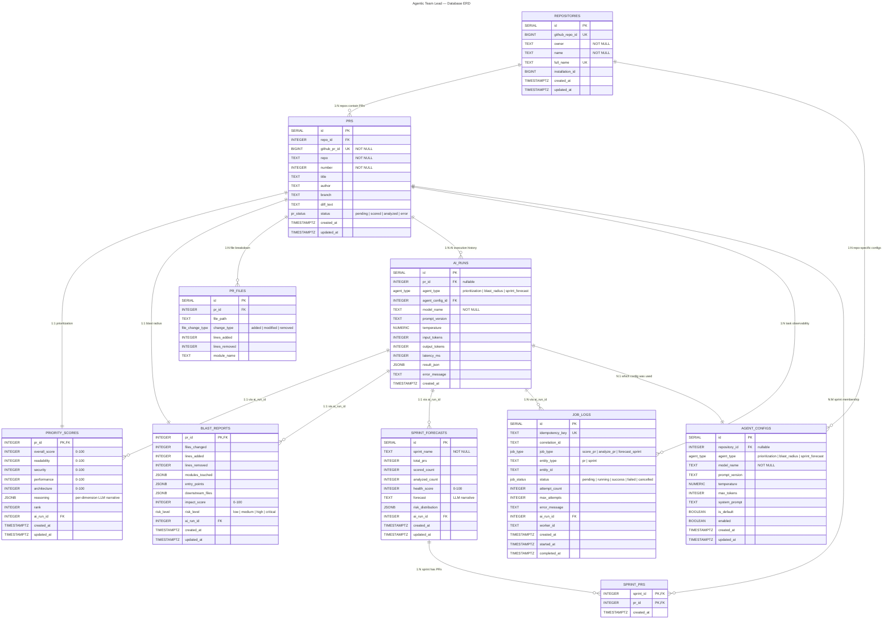

# Database ERD

> **Stack:** PostgreSQL · FastAPI BackgroundTasks · Modular Monolith  
> **Generated:** 2026-08-08

---

## Entity Relationship Diagram



---

## Module Ownership

Each table is owned by exactly one module. No module writes to another module's tables.

| Module | Tables | Description |
|--------|--------|-------------|
| **Shared Kernel** | `repositories`, `prs` | GitHub App context and central PR registry. Read by all modules. |
| **Prioritization** | `priority_scores` | LLM scoring output per PR. Links to `ai_runs` for metadata. |
| **Blast Radius** | `blast_reports`, `pr_files` | Impact analysis output and normalized file breakdown. Links to `ai_runs` for metadata. |
| **Sprint Forecast** | `sprint_forecasts`, `sprint_prs` | Aggregate health snapshots and sprint-to-PR links. Links to `ai_runs` for metadata. |
| **AI Infrastructure** | `ai_runs`, `agent_configs` | Execution history and user-configurable settings (model, prompt, temperature). |
| **Observability** | `job_logs` | Lightweight task tracking with idempotency, retries, and correlation. |

---

## Table Specifications

Detailed column definitions, JSONB structures, constraints, and indexes for every table are documented in [`schema.md`](schema.md).

| Table | Section in schema.md |
|-------|---------------------|
| `repositories` | [repositories](#repositories) |
| `prs` | [prs — Shared Kernel](#prs--shared-kernel) |
| `priority_scores` | [priority_scores — Prioritization Module](#priority_scores--prioritization-module) |
| `blast_reports` | [blast_reports — Blast Radius Module](#blast_reports--blast-radius-module) |
| `pr_files` | [pr_files — Blast Radius File Breakdown](#pr_files--blast-radius-file-breakdown) |
| `sprint_forecasts` | [sprint_forecasts — Sprint Forecast Module](#sprint_forecasts--sprint-forecast-module) |
| `sprint_prs` | [sprint_prs — Sprint to PR Junction](#sprint_prs--sprint-to-pr-junction) |
| `ai_runs` | [ai_runs — AI Execution History](#ai_runs--ai-execution-history) |
| `agent_configs` | [agent_configs — User-Configurable AI Settings](#agent_configs--user-configurable-ai-settings) |
| `job_logs` | [job_logs — Background Task Observability](#job_logs--background-task-observability) |

---

## Relationship Rules

| From | To | Cardinality | Meaning |
|------|-----|-------------|---------|
| `repositories` | `prs` | **1:N** | One repo contains many PRs |
| `repositories` | `agent_configs` | **1:N** | One repo has many config overrides |
| `prs` | `priority_scores` | **1:1** | Every scored PR has one score set |
| `prs` | `blast_reports` | **1:1** | Every analyzed PR has one impact report |
| `prs` | `pr_files` | **1:N** | One PR touches many files |
| `prs` | `ai_runs` | **1:N** | One PR has many AI agent invocations (re-runs, different agents) |
| `prs` | `job_logs` | **1:N** | One PR generates many task runs and retries |
| `prs` | `sprint_prs` | **N:M** | One PR belongs to many sprints over time |
| `sprint_forecasts` | `sprint_prs` | **1:N** | One sprint contains many PRs |
| `ai_runs` | `priority_scores` | **1:1** | One AI run produces one priority score |
| `ai_runs` | `blast_reports` | **1:1** | One AI run produces one blast report |
| `ai_runs` | `sprint_forecasts` | **1:1** | One AI run produces one sprint forecast |
| `ai_runs` | `job_logs` | **1:N** | One AI run may be linked to multiple task attempts |
| `agent_configs` | `ai_runs` | **1:N** | One config is used by many AI runs |

**No direct relationship** between `priority_scores` and `blast_reports`. They meet only through `prs` or `v_pr_overview`.

---

## Module Boundaries

```
┌─────────────────────────────────────────┐
│  api/webhooks.py                        │
│  api/prs.py                             │
│  api/dashboard.py  ──► v_pr_overview    │
└─────────────────────────────────────────┘
              │
              │ BackgroundTasks
              ▼
┌─────────────────────────┐  ┌─────────────────────────┐
│  core/prioritization/   │  │  core/blast_radius/     │
│  writes: priority_scores│  │  writes: blast_reports  │
│  reads: prs, ai_runs    │  │  writes: pr_files       │
│                         │  │  reads: prs, ai_runs    │
└──────────┬──────────────┘  └──────────┬──────────────┘
           │                            │
           └────────────┬───────────────┘
                        │ delegates to
           ┌────────────▼───────────────┐
           │  core/ai/orchestrator.py   │
           │  writes: ai_runs           │
           │  reads: agent_configs      │
           └────────────────────────────┘
                        │
                        ▼
           ┌─────────────────────────────┐
           │  common/models.py (PR)      │
           │  database.py (PostgreSQL) │
           └─────────────────────────────┘
```

| # | Rule |
|---|------|
| 1 | `core/prioritization/` **never** imports from `core/blast_radius/` and vice versa |
| 2 | Both modules **read** `common/models.PR` but **write only to their own** tables |
| 3 | `core/ai/orchestrator.py` is the **only** cross-domain coordinator |
| 4 | Agents **never** import from services — they receive pure data and return structured results |
| 5 | `api/dashboard.py` is the **only** join point allowed to query both module tables |
| 6 | `api/` never calls `core/` directly for writes — always through `BackgroundTasks` |

---

## Index Strategy

| Index | Table | Purpose |
|-------|-------|---------|
| `idx_repositories_github_id` | `repositories` | Lookup by GitHub ID |
| `idx_repositories_full_name` | `repositories` | Lookup by owner/name |
| `idx_prs_status` | `prs` | Filter active PRs |
| `idx_prs_repo` | `prs` | Repo-scoped listings |
| `idx_prs_created_at DESC` | `prs` | Chronological order |
| `idx_prs_repo_id` | `prs` | Join to repositories |
| `idx_prs_github_pr_id` | `prs` | Lookup by stable GitHub ID |
| `idx_priority_scores_overall DESC` | `priority_scores` | Score ranking |
| `idx_priority_scores_rank` | `priority_scores` | Rank queries |
| `idx_priority_scores_ai_run` | `priority_scores` | Join to AI metadata |
| `idx_blast_reports_impact DESC` | `blast_reports` | Risk sorting |
| `idx_blast_reports_risk` | `blast_reports` | Risk filtering |
| `idx_blast_reports_ai_run` | `blast_reports` | Join to AI metadata |
| `idx_pr_files_pr_id` | `pr_files` | Files per PR |
| `idx_pr_files_module` | `pr_files` | Graph traversal |
| `idx_sprint_forecasts_sprint` | `sprint_forecasts` | Sprint filter |
| `idx_sprint_forecasts_created DESC` | `sprint_forecasts` | Trend charts |
| `idx_sprint_forecasts_ai_run` | `sprint_forecasts` | Join to AI metadata |
| `idx_sprint_prs_sprint` | `sprint_prs` | Sprint members |
| `idx_sprint_prs_pr` | `sprint_prs` | PR sprints |
| `idx_ai_runs_pr_id` | `ai_runs` | Per-PR history |
| `idx_ai_runs_agent` | `ai_runs` | Agent filter |
| `idx_ai_runs_created DESC` | `ai_runs` | Recent runs |
| `idx_ai_runs_model` | `ai_runs` | Cost analysis by model |
| `idx_ai_runs_config` | `ai_runs` | Join to agent_configs |
| `idx_agent_configs_repo` | `agent_configs` | Repo-specific configs |
| `idx_agent_configs_agent` | `agent_configs` | Agent filter |
| `idx_agent_configs_default` | `agent_configs` | Fallback lookup |
| `idx_job_logs_idempotency` | `job_logs` | Prevent duplicate enqueue |
| `idx_job_logs_correlation` | `job_logs` | Trace retries |
| `idx_job_logs_status_attempt` | `job_logs` | Find retryable failures |
| `idx_job_logs_status_started` | `job_logs` | Detect stuck jobs |
| `idx_job_logs_entity` | `job_logs` | History for PR or sprint |
| `idx_job_logs_worker` | `job_logs` | Debug by process |
| `idx_job_logs_created DESC` | `job_logs` | Activity feed |
